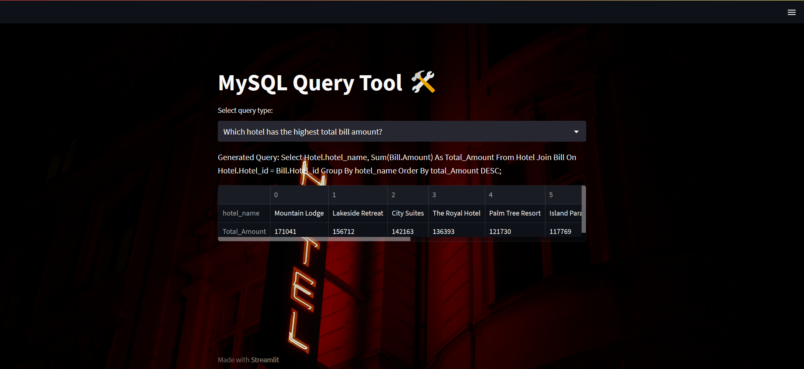

# Hotel Query Tool using Streamlit

This is a simple web application built using Streamlit that allows users to search for hotels by entering their destination or hotel id. The app displays a list of available hotels with their corresponding prices and ratings.

# Built With

    Python
    Streamlit
    MySQL

# Getting Started

To get started, you can clone this repository and install the required packages by running 

    pip install streamlit mysql-connector-python 

Then, you can run the app locally by running 

    streamlit run app.py 

and accessing the app in your browser at 

    http://localhost:8501

these are the users currently authenticated

    users = {
        "alice": "password123",
        "bob": "letmein",
        "charlie": "abc123"
    }

# Usage

Once you have the app running, you can enter your destination and travel dates in the input fields and click on the "Search" button. The app will then retrieve hotel data from a sample dataset and display a list of available hotels with their corresponding prices and ratings. You can use the slider to filter hotels by their minimum rating and the dropdown menu to sort hotels by either price or rating.

# Contributing

If you'd like to contribute to this project, feel free to submit a pull request or open an issue.
License

This project is licensed under the MIT License - see the LICENSE.md file for details.